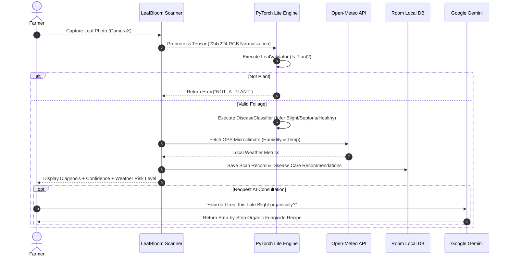

# LeafBloom (AI Plant Pathology & Diagnostics Engine)

[](https://developer.android.com)
[](https://kotlinlang.org/)
[](https://developer.android.com)
[](https://pytorch.org/mobile/android/)
[](https://ai.google.dev/)
[](https://developer.android.com/training/data-storage/room)
[](LICENSE)

> Intelligent Android agricultural diagnostics platform combining on-device PyTorch Mobile Lite vision classifiers, real-time CameraX scanning, hyper-local microclimate weather context, and Google Gemini AI botanical consultations.

---

## 📖 Overview

**LeafBloom** is an advanced agritech and plant pathology mobile application engineered to empower farmers, agronomists, and horticulture enthusiasts with instant, lab-grade crop diagnostics. Built with **Kotlin**, **Android SDK 36**, and **Clean MVVM Architecture**, LeafBloom executes on-device edge neural network inference in under 50ms using **PyTorch Mobile Lite** to detect crop diseases, classify insect pests, assess fruit ripeness, and validate plant foliage—all functioning completely offline.

For complex botanical inquiries, LeafBloom connects seamlessly with **Google Gemini Generative AI** and **Open-Meteo microclimate weather APIs** to deliver customized treatment plans tailored to local humidity, temperature, and precipitation forecasts.

### Core Architectural Pillars
- **Zero-Latency On-Device Vision**: 4 specialized PyTorch Mobile Lite (`.ptl`) models running locally on CPU/NNAPI for offline crop disease and pest identification.
- **Intelligent Gatekeeper Validation**: Pre-inference leaf validation model (`leaf_nonleaf_model.ptl`) preventing false positives on background objects.
- **Multimodal Gemini Botanical Assistant**: Live conversational AI providing scientific treatment regimens, organic remedy recipes, and preventive agricultural advice.
- **Hyper-Local Agro-Meteorology**: Real-time GPS weather integration fetching localized vapor pressure deficit, humidity, and heat factors that correlate with fungal spore outbreaks.
- **Bilingual & RTL-Ready**: Full localization support for English and Urdu (`supportsRtl="true"`).

---

## 🏗️ Architecture & AI Pipeline

```mermaid
graph TD
    subgraph Camera & Capture Layer
        Cam[CameraX Live Viewfinder]
        Crop[Android Image Cropper / Normalizer]
    end

    subgraph Edge AI Inference Pipeline (PyTorch Mobile Lite)
        Gate[LeafValidator: leaf_nonleaf.ptl]
        Disease[DiseaseClassifier: tomato_disease_robust.ptl]
        Pest[PestClassifier: pest_id_model.ptl]
        Ripe[RipenessClassifier: ripeness_model.ptl]
    end

    subgraph Cloud & Service Layer
        Gemini[Google Gemini Generative AI]
        Weather[Open-Meteo Weather API]
        CloudIdentify[Firebase Functions Plant ID]
    end

    subgraph Data & Persistence Layer
        Room[(Room Database: Scan & Weather Entities)]
        Exporter[PDF & Image Report Exporter]
    end

    Cam --> Crop
    Crop --> Gate
    Gate -->|Valid Leaf| Disease
    Gate -->|Pest Mode| Pest
    Gate -->|Fruit Mode| Ripe
    Gate -->|Invalid Input| Error[Surface 'Not a Plant' Alert]

    Disease --> Room
    Pest --> Room
    Ripe --> Room
    Weather --> Room

    Room --> Exporter
    Gemini <--> ChatUI[Botanical AI Chat]
```

### Complete Diagnostic Flow



---

## ✨ Core Features

### 1. 🔬 On-Device Edge AI Classifiers
- **Disease Diagnosis (`tomato_disease_robust.ptl`)**: Classifies Early Blight, Late Blight, Septoria Leaf Spot, and Healthy foliage with sub-millisecond inference and confidence scores.
- **Foliage Gatekeeper (`leaf_nonleaf_model.ptl`)**: Deep neural network verifying whether captured imagery contains valid botanical leaves before triggering downstream models.
- **Pest Identification (`pest_id_model.ptl`)**: Detects common agricultural crop pests and destructive insect larvae.
- **Ripeness Grading (`ripeness_model.ptl`)**: Evaluates crop maturity and optimal harvesting windows.

### 2. 🤖 Google Gemini Botanical Consultation
- **Conversational Plant Expert**: Chat directly with Google Gemini Generative AI regarding crop symptoms, fertilizer ratios, and organic fungicide recipes.
- **Context-Aware Recommendations**: Integrates disease classification tags and current weather conditions into prompt contexts.

### 3. 🌦️ Agro-Meteorology & Microclimate Analysis
- **GPS Weather Integration**: Retrieves real-time local temperature, relative humidity, wind speed, and precipitation.
- **Fungal Outbreak Risk Indicator**: Correlates high moisture and heat thresholds with fungal spore multiplication warnings.

### 4. 📚 Comprehensive Plant Pathology Library
- **Curated Disease Compendium**: Detailed pathology profiles including symptoms, causal agents, biological controls, and chemical treatments.
- **Offline Knowledge Access**: High-resolution imagery and disease symptoms available completely offline.

### 5. 📑 Diagnostic History & Report Export
- **Room Local Ledger**: Historical catalog of all past scans with timestamps, GPS coordinates, and diagnostic confidences.
- **Visual Report Exporter (`ResultExporter.kt`)**: Export comprehensive diagnostic summary cards as shareable images or PDF files.

---

## 📱 Key Screens & Navigation Map

| Module | Fragment / View | Description |
|---|---|---|
| **Onboarding & Auth** | `WalkthroughFragment`, `LoginFragment`, `SignupFragment` | Interactive onboarding carousel (`WalkthroughAdapter`) and user profiles. |
| **Home Dashboard** | `HomeFragment` | Quick-scan FAB, microclimate weather card, tip carousel, and recent scans. |
| **Live Scanner** | `ScannerFragment`, `CropFragment` | CameraX live viewfinder, grid guides, flash controls, and cropping box. |
| **Diagnosis Results** | `DiagnoseResultFragment`, `IdentifyResultFragment`, `PestResultFragment` | Class confidence breakdown, treatment timeline, and chemical/organic remedies. |
| **Disease Library** | `DiseaseLibraryFragment` | Searchable compendium of plant diseases, pests, and symptoms. |
| **Botanical AI Chat** | `ChatFragment` | Interactive Gemini AI plant doctor consultation console. |
| **History & Details** | `HistoryFragment`, `HistoryDetailsFragment` | Filterable scan archive with photo comparisons and export tools. |

---

## 🛠️ Technical Stack Matrix

| Layer | Technologies / Libraries |
|---|---|
| **Language & Tooling** | Kotlin 2.0.21, JDK 17/21, KSP (Kotlin Symbol Processing), Target SDK 36 |
| **UI Framework** | Android Jetpack (ViewBinding, SafeArgs Navigation, ConstraintLayout, Material 3) |
| **On-Device Machine Learning**| PyTorch Mobile Lite (`org.pytorch:pytorch_android_lite:1.13.1`, `torchvision_lite`) |
| **Generative AI** | Google Gemini AI (`com.google.ai.client.generativeai:generativeai:0.9.0`) |
| **Camera & Media** | CameraX 1.4+ (Camera2, Lifecycle, View, Extensions), Android Image Cropper |
| **Local Database** | Android Jetpack Room DB (with KSP code generation) |
| **Networking & Weather**| Retrofit2, OkHttp3 Logging Interceptor, Open-Meteo Weather API |
| **Location & Hardware** | Google Play Services Location API |

---

## 🚀 Getting Started

### Prerequisites
- **Android Studio Ladybug (2024.2.1+)** or newer.
- **JDK 17** configured as Gradle JVM.
- **Android SDK 36** installed.
- (Optional) A **Google Gemini API Key** from [Google AI Studio](https://aistudio.google.com/).

### Setup & Installation

1. **Clone the Repository**:
   ```bash
   git clone https://github.com/shayann07/LeafBloom.git
   cd LeafBloom
   ```

2. **Configure Environment Keys**:
   ```bash
   cp local.properties.example local.properties
   ```
   Edit `local.properties`:
   ```properties
   sdk.dir=C\:\\Users\\<YourUsername>\\AppData\\Local\\Android\\Sdk
   GEMINI_API_KEY=YOUR_GOOGLE_GEMINI_API_KEY
   ```

3. **Verify Edge AI Assets**:
   Ensure pre-trained PyTorch Lite models (`.ptl`) are present in `app/src/main/assets/`:
   - `tomato_disease_robust.ptl`
   - `leaf_nonleaf_model.ptl`
   - `pest_id_model.ptl`
   - `ripeness_model.ptl`

4. **Build and Run**:
   ```bash
   # Assemble Debug Build
   ./gradlew assembleDebug

   # Run Unit Tests
   ./gradlew testDebugUnitTest
   ```

---

## 📄 License

This project is open-source software licensed under the [MIT License](LICENSE) — Copyright (c) 2026 [shayann07](https://github.com/shayann07).
